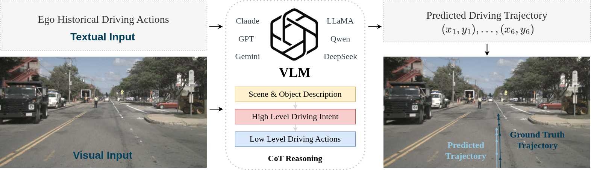

# LightEMMA: Lightweight End-to-end Multimodal Autonomous Driving

[](https://opensource.org/licenses/MIT)
[](https://www.python.org/downloads/)
[](https://www.nuscenes.org/nuscenes)
[](https://huggingface.co/)

Paper link: https://drive.google.com/file/d/1WUIiowMhOiOHoPpaUjZvkPRmG5QOcX7f/view?usp=sharing

LightEMMA is an open-loop, end-to-end autonomous driving framework designed to leverage the zero-shot capabilities of vision-language models (VLMs). Its primary task is the prediction of driving actions and trajectories, evaluated using real-world driving scenarios from the nuScenes dataset. The framework integrates multiple state-of-the-art VLMs, including **GPT**, **Claude**, **Gemini**, **Qwen**, **DeepSeek**, **Llama**.



## Table of Contents

- [Overview](#overview)
- [Features](#features)
- [Supported Models](#supported-models)
- [Environment Setup](#environment-setup)
  - [Prerequisites](#prerequisites)
  - [Installation](#installation)
  - [Code Structure](#code-structure)
  - [Dataset Preparation](#dataset-preparation)
  - [Configuration](#configuration)
- [Usage](#usage)
  - [Run Predictions](#run-predictions)
  - [Run Baseline](#run-baseline)
  - [Evaluation](#evaluation)
  - [Comparing Models](#comparing-models)
- [License](#license)
- [Citation](#citation)

## Overview

LightEMMA processes front-camera images from the nuScenes dataset and leverages VLMs using a chain-of-thought (CoT) reasoning approach.

1. **Scene Description**: Generate detailed descriptions of the driving environment, including lane markings, traffic lights, vehicles, pedestrian activities, and other pertinent objects.
2. **Driving Intent Analysis**: Understand the driving intent from the current scene and the ego vehicle's historical actions to predict the subsequent high-level driving maneuver.
3. **Trajectory Prediction**: Convert high-level driving intentions into low-level driving actions, specifying precise speed and curvature values.

This end-to-end approach allows LightEMMA to leverage the rich semantic understanding capabilities of VLMs for zero-shot autonomous driving.


## Features

1. **Model Extensibility**: Supports 12 state-of-the-art VLMs, with an extensible framework that enables easy integration of additional models.
2. **Computational Metrics**: Extensive computational analysis including ininference time, cost, token usage, and hardware specifications.
3. **Benchmark Compatibility**: Standard L2 error analysis compatible with the nuScenes benchmark, enabling direct comparison and visualization.

### Supported Models

LightEMMA supports the following VLMs (we recommend not using DeepSeek-VL due to its poor performance and environmental incompatibility):

**Commercial API-based models**:
- [`gpt-4o`](https://platform.openai.com/docs/models/gpt-4o): OpenAI GPT-4o
- [`gpt-4.1`](https://platform.openai.com/docs/models/gpt-4.1): OpenAI GPT-4.1
- [`claude-3.7`](https://docs.anthropic.com/claude/docs/models-overview): Anthropic Claude-3.7-Sonnet
- [`claude-3.5`](https://docs.anthropic.com/claude/docs/models-overview): Anthropic Claude-3.5-Sonnet
- [`gemini-2.5`](https://ai.google.dev/models/gemini): Google Gemini-2.5-Pro
- [`gemini-2.0`](https://ai.google.dev/models/gemini): Google Gemini-2.0-Flash

**Open-source Local models**:
- [`qwen2.5-7b`](https://huggingface.co/Qwen/Qwen2.5-VL-7B-Instruct): Qwen2.5-VL-7B-Instruct
- [`qwen2.5-72b`](https://huggingface.co/Qwen/Qwen2.5-VL-72B-Instruct): Qwen2.5-VL-72B-Instruct
- [`llama-3.2-11b`](https://huggingface.co/meta-llama/Llama-3.2-11B-Vision-Instruct): Llama-3.2-11B-Vision-Instruct
- [`llama-3.2-90b`](https://huggingface.co/meta-llama/Llama-3.2-90B-Vision-Instruct): Llama-3.2-90B-Vision-Instruct
- [`deepseek-vl2-16b`](https://huggingface.co/deepseek-ai/deepseek-vl2-small):
deepseek-vl2-small
- [`deepseek-vl2-28b`](https://huggingface.co/deepseek-ai/deepseek-vl2): deepseek-vl2


## Environment Setup

### Recommended Settings
- **System:** Ubuntu 22.04
- **CUDA:** 12.4
- **Python:** 3.10
- **Commercial Models:** Active API keys required.
- **Open-source Models:** High-performance, high-memory CUDA-compatible GPUs (e.g., NVIDIA L40, H100). Multi-GPU setups advised for scaling large models and accelerating inference.


### Installation

1. Clone the repository:
   ```bash
   git clone https://github.com/michigan-traffic-lab/LightEMMA.git
   ```

2. Create and activate a conda environment:
   ```bash
   cd LightEmma
   conda create -n lightemma python=3.10
   conda activate lightemma
   ```

3. Install LightEMMA and its dependencies:
   ```bash
   pip install -e .
   ```

## Code Structure

- `predict.py`: Main script for generating predictions
- `evaluate.py`: Evaluates prediction results for a single model
- `baseline.py`: Evaluates constant velocity baseline predictions
- `evaluate_all.py`: Processes results from multiple models for comparison
- `vlm.py`: Utility functions to run vision-language models
- `utils.py`: Utility functions for trajectory calculations and visualization
- `setup.py`: Package installation and dependency configuration


### Dataset Preparation

Register an account on the [nuScenes website](https://www.nuscenes.org/nuscenes). Scroll down to download the **Full dataset (v1.0)** and extract it to your desired location. We recommend starting with `v1.0-mini` for initial experiments, then proceeding to a full evaluation using `v1.0-test`. All experiments in this evaluation use the **US** dataset version.

<!-- The dataset should have the following structure:
```
/path/to/nuscenes/
├── maps/
├── samples/
│   ├── CAM_BACK/
│   ├── CAM_BACK_LEFT/
│   ├── CAM_BACK_RIGHT/
│   ├── CAM_FRONT/
│   ├── CAM_FRONT_LEFT/
│   ├── CAM_FRONT_RIGHT/
│   ├── LIDAR_TOP/
│   └── RADAR_FRONT/
├── sweeps/
├── v1.0-mini
│   ├── attribute.json
│   ├── calibrated_sensor.json
│   ├── category.json
│   ├── ego_pose.json
│   ├── instance.json
│   ├── log.json
│   ├── map.json
│   ├── sample.json
│   ├── sample_annotation.json
│   ├── sample_data.json
│   ├── scene.json
│   ├── sensor.json
│   └── visibility.json
└── README.md
``` -->

### Configuration

Configure your API keys and dataset paths in `config.yaml`:

```yaml
# API Keys
api_keys:
  openai: "your-openai-api-key"  # GPT models
  anthropic: "your-anthropic-api-key"  # Claude models
  gemini: "your-gemini-api-key"  # Gemini models
  huggingface: "your-huggingface-api-key"  # To download models from HuggingFace

model_path:
  huggingface: "path/to/huggingface/models"  # directory to store downloaded models

# Dataset
data:
  root: "/path/to/nuscenes"  # Path to nuScenes dataset
  version: "v1.0-mini"  # Dataset version (v1.0-mini, v1.0-trainval, v1.0-test)
  results: "results"  # Directory to store results

# Prediction Parameters (do not change)
prediction:
  obs_len: 6  # Number of past observations (frames)
  fut_len: 6  # Number of future predictions (frames)
  ext_len: 2  # Extra length for calculations (frames)
```

## Usage

### Run Predictions

We use GPT-4o in the following examples, but you can substitute it with any model listed in the previous section.

To run prediction on all scenes:

```bash
python predict.py --model gpt-4o --all_scenes
```

To run a specific scene:

```bash
python predict.py --model gpt-4o --scene scene-0103
```

To continue from a previous run:

```bash
python predict.py --model gpt-4o --continue_dir results/gpt-4o_20250415-123
```

### Run Baseline (Optional)
To establish a constant velocity baseline:

```bash
python baseline.py
```

### Evaluation

To evaluate the performance of a single model:

```bash
python evaluate.py --results_dir results/gpt-4o_20250415-123
```

If visualization is not needed (faster):

```bash
python evaluate.py --results_dir results/gpt-4o_20250415-123 --no_vis
```

<!-- If the nuScenes dataset is stored in a different location than where the evaluations were generated:

```bash
python evaluate.py --results_dir results/gpt-4o_20250415-123 --local_samples_path /path/to/nuscenes/samples
``` -->


### Comparing Models

To process evaluation results from multiple models and generate comparative analysis:

```bash
python evaluate_all.py
```

<!-- ## Results Directory Structure

After running predictions and evaluations, the results directory will have the following structure:

```
results/
├── model_name_timestamp/         # Directory for each model run (e.g., gpt-4o_20250427-120000)
│   ├── output/                   # Raw prediction outputs
│   │   ├── scene-0001.json       # Predictions for scene-0001
│   │   ├── scene-0002.json       # Predictions for scene-0002
│   │   └── ...
│   ├── frame/                    # Visualization images
│   │   ├── scene-0001_frame0.png # Visualization for scene-0001, frame 0
│   │   ├── scene-0001_frame1.png # Visualization for scene-0001, frame 1
│   │   └── ...
│   └── analysis/                 # Evaluation results
│       ├── evaluation.json       # Evaluation metrics
│       ├── evaluation_all.json   # Filtered evaluation (after error removal)
│       └── errors.txt            # List of error frames
├── baseline/                     # Constant velocity baseline results
│   ├── output/                   # (same structure as above)
│   ├── frame/
│   └── analysis/
└── frames_merge/                 # Comparison visualizations
    ├── scene-0001/               # Comparisons for scene-0001
    │   ├── comparison_frame0.png # Multi-model comparison, frame 0
    │   ├── comparison_frame1.png # Multi-model comparison, frame 1
    │   └── ...
    ├── scene-0002/
    └── ...
```

Each scene JSON file in the output directory contains:
- Scene metadata and description
- Frame-by-frame predictions and ground truth
- Token usage and time statistics
- Camera parameters and ego vehicle state -->

<!-- ## Metrics

LightEMMA evaluation produces the following metrics:

- **L2 distances** at 1s, 2s, and 3s horizons
- **ADE** (Average Displacement Error)
- **FDE** (Final Displacement Error) 
- **Rate_2** (miss rate at 2 meters threshold)
- **Token usage** statistics (input/output tokens per prompt)
- **Inference time** statistics (seconds per scene/prompt) -->

## License

This project is licensed under the MIT License - see the LICENSE file for details.

## Citation

If you use LightEMMA in your research, please consider citing:

```bibtex
@article{lightemma2025,
  title={LightEMMA: Lightweight End-to-end Multimodal Autonomous Driving via Vision Language Models},
  author={...},
  journal={...},
  year={2025}
}
```
